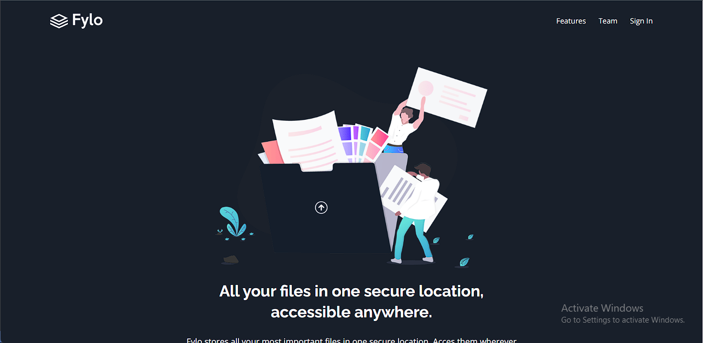

# Frontend Mentor - Fylo dark theme landing page solution

This is a solution to the [Fylo dark theme landing page challenge on Frontend Mentor](https://www.frontendmentor.io/challenges/fylo-dark-theme-landing-page-5ca5f2d21e82137ec91a50fd). Frontend Mentor challenges help you improve your coding skills by building realistic projects.

## Table of contents

- [Overview](#overview)
  - [The challenge](#the-challenge)
  - [Screenshot](#screenshot)
  - [Links](#links)
- [My process](#my-process)
  - [Built with](#built-with)
  - [What I learned](#what-i-learned)
  - [Useful resources](#useful-resources)
- [Author](#author)

## Overview

### The challenge

Users should be able to:

- View the optimal layout for the site depending on their device's screen size
- See hover states for all interactive elements on the page

### Screenshot




### Links

- Solution URL: [click here](https://www.frontendmentor.io/solutions/responsive-fylo-landing-page-built-using-react-vite-tailwindcss-wi9_jmrcvA)
- Live Site URL: [click here](https://fylo-landing-p.netlify.app/)

## My process

### Built with

- Semantic HTML5 markup
- CSS custom properties
- Flexbox
- Mobile-first workflow
- [TailwindCSS](https://tailwindcss.com/docs/installation) - CSS Framework
- [React](https://reactjs.org/) - JS library

### What I learned

I had to practice what I've been learning on react, and I implemented input validation in this challenge, the code snippet is below.
I also had to implement responsive navbar, which was kind of the trickiest part of this challenge, the code snippet is also below

```js
const validateEmail = function (email) {
  const regex = /^[a-zA-Z0-9_.+-]+@[a-zA-Z0-9-]+\.[a-zA-Z0-9-.]+$/;
  return regex.test(email);
};

const [form, setFormValue] = useState({
  value: '',
  msg: '',
  valid: false,
});

const handleInput = function (e) {
  setFormValue((previousObj) => {
    return { ...previousObj, value: e.target.value };
  });
};

const handleFormSubmit = function () {
  // if input valid
  if (validateEmail(form.value)) {
    setFormValue((previousState) => ({ ...previousState, msg: 'Email Submitted', valid: true }));
    setTimeout(() => setFormValue((_) => ({ value: '', msg: '', valid: false })), 2000);
    return;
  }

  // if input invalid
  setFormValue((previousState) => ({ ...previousState, msg: 'Please enter a valid email address', valid: false }));
  setTimeout(() => {
    setFormValue((previousState) => ({ ...previousState, msg: '' }));
  }, 2000);
};

---

export default function Header() {
  // false = hidden, true = open
  const [navState, setNavState] = useState({
    navBarOpen: false,
    toggleContainerOpen: false,
  });
  const isSmallScreen = useMediaQuery('(max-width:768px)');

  const toggleMenu = function () {
    setNavState((previousValue) => {
      return {
        navBarOpen: !previousValue.navBarOpen,
        toggleContainerOpen: !previousValue.toggleContainerOpen,
      };
    });
  };

  return (
    <header className="w-full">
      <nav className="container mx-auto flex items-center justify-between p-6 relative">
        

        <ul
          className={`navList--items items-center gap-6 text-white bg-cyanInsideCTA w-full absolute rounded-lg p-6 top-[60px] left-0 md:flex h-[200px] md:relative md:top-0 md:h-auto md:bg-transparent md:p-0 md:w-auto ${
            isSmallScreen && (navState.navBarOpen ? 'translate-x-[0%]' : 'translate-x-[120%]')
          }`}
        >
          <li className="hover:underline hover:font-bold text-lg">
            <a href="#">Features</a>
          </li>
          <li className="hover:underline text-lg hover:font-bold">
            <a href="#">Team</a>
          </li>
          <li className="hover:underline text-lg hover:font-bold">
            <a href="#">Sign In</a>
          </li>
        </ul>

        <div className="toggleContainer cursor-pointer block md:hidden" onClick={toggleMenu}>
          <div className={`line1 ${isSmallScreen && navState.toggleContainerOpen && 'open'}`}></div>
          <div className={`line2 ${isSmallScreen && navState.toggleContainerOpen && 'open'}`}></div>
          <div className={`line3 ${isSmallScreen && navState.toggleContainerOpen && 'open'}`}></div>
        </div>
      </nav>

      <Hero />
    </header>
  );
}
```

### Useful resources

- [Font Awesome](https://fontawesome.com/) - The Icons used in the footer section of this page was gotten from fontawesome.

## Author

- Website - [Abdullah Ayoola](https://github.com/abdullah43577)
- Frontend Mentor - [@abdullah43577](https://www.frontendmentor.io/profile/abdullah43577)
- Twitter - [@officialayo540](https://twitter.com/officialayo540)
